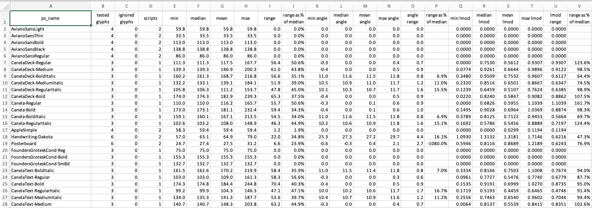

# Summarize
This tool reads a `FontDatabase.json` file written by `RasterSamplingTool` and writes s summary Excel spreadsheet with a summary row for each font.
Each row contains the font's postscript name and the mean values of the selected stroke widths, stroke angle and R² for the line fit to the center of the stroke.

### Example summary rows

See [RasterSamplingTool](RasterSamplingTool.md) and [OutputDatabase](OutputDatabase.md) for details.

## Command Line Options
* **\-\-input *path*** - the path to the `OutputDatabase.json` file.
* **\-\-output *path*** - the path to the summary Excel spreadsheet.
